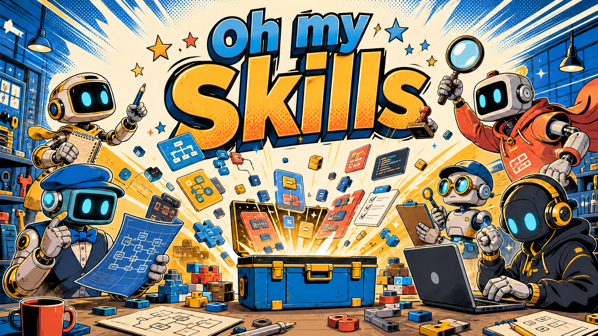

# oh-my-skills

`oh-my-skills` 是我会持续更新维护的个人 Agent skills 收藏仓库。

这个仓库不是用来堆一次性 prompt 的，也不是零散笔记。它的目标是把真正有用的 Agent 工作流沉淀成可复用的 skill package：有明确触发条件、硬规则、references、examples、验证方式，也有给人看的说明文档。

当前从 `engineered-vibe-coding` 开始，后续会随着真实使用持续打磨，逐步沉淀更多适合长期复用的 Agent 工作流。

## 为什么做这个仓库

AI 写代码已经很快了，但真正难的不是“快”，而是在需求模糊、任务变大、改动跨模块时，仍然让 Agent 的工作保持可控、可审查、可维护。

`oh-my-skills` 想解决的是这件事：

- 把可重复的 Agent 工作流沉淀成 skill。
- 把关键工程规则写进可加载的上下文，而不是依赖临时记忆。
- 让规划、验证、审核过程可见。
- 防止高风险任务变成未经审查的快速堆代码。
- 根据真实使用持续迭代 skill。

## 当前收录

| Skill | 状态 | 说明 |
| --- | --- | --- |
| [`engineered-vibe-coding`](skills/engineered-vibe-coding) | 草稿 / 持续维护中 | Agent-Team-first 工程化编码 workflow skill，用于需求规划、架构规划、模块拆分、atomic task 细分、checkpoint、验证、角色审核证据和反屎山闸门。 |

### `engineered-vibe-coding`

`engineered-vibe-coding` 面向复杂软件开发任务。它的核心不是让 Agent 更快写代码，而是让 Agent 不要拿到需求就直接开写。

它要求 Agent：

- 先探查项目，再询问用户；能从代码发现的答案不问用户；
- 将任务风险分为 Light / Standard / Strict；
- 实现前先澄清需求；
- 规划架构和模块边界；
- 将模块继续拆成 atomic tasks；
- Standard / Strict 工作流使用 `.agent/dev-plan.md` 作为 single source of truth；
- 通过 Plan、First Slice、Release 三个 checkpoint；
- 优先使用 Agent Team review，其次 subagent review，最后才 main-agent self-review；
- 记录每个角色的审核证据；
- 从项目文件中发现验证命令，不凭空发明命令；
- validation、review、anti-spaghetti gate 失败时阻断继续推进。

简单说：小任务保持轻量；中大型和高风险任务必须进入真正的工程流程。

## 仓库结构

```text
oh-my-skills/
├── README.md
├── README.zh-CN.md
├── skills.json
└── skills/
    └── engineered-vibe-coding/
        ├── SKILL.md
        ├── README.md
        ├── README.zh-CN.md
        ├── agents/
        │   └── openai.yaml
        └── references/
            ├── workflow.md
            ├── roles.md
            ├── dev-plan-template.md
            ├── review-checklists.md
            └── examples/
```

## 维护方式

这个仓库会持续维护。

我会根据真实 Agent 使用情况不断调整：

- 如果 Agent 容易跳步骤，就把规则写硬；
- 如果主 `SKILL.md` 变重，就把细节拆进 references；
- 如果某类任务行为不稳定，就补 examples 校准；
- 如果平台能力变化，就更新验证和安装方式；
- 如果流程稳定到可以自动化，再考虑加入小脚本。

目标不是冻结一个“完美 prompt”，而是持续打磨一套真正可复用、可检查、可演进的 Agent 工作流。

## 验证

验证当前 Codex-compatible skill：

```bash
uv run --with pyyaml python /Users/anhuike/.codex/skills/.system/skill-creator/scripts/quick_validate.py skills/engineered-vibe-coding
```

期望结果：

```text
Skill is valid!
```

## 本地安装

如果要把 `engineered-vibe-coding` 安装到本地 Codex：

```bash
cp -R skills/engineered-vibe-coding /Users/anhuike/.codex/skills/
```

仓库里优先保留草稿形态。只有当你希望 Codex 自动发现它时，再安装到 Codex skills 目录。

## 版本方向

- **V1**：硬工程规则。
- **V2**：带 checkpoint 和 First Slice 的 workflow state model。
- **V3**：Agent-Team-first role execution with evidence。
- **V4**：可选自动化脚本，例如 dev-plan 初始化、validation command discovery。

## 理念

一个好的 Agent skill 应该让 Agent 更能干，而不是更草率。

对编码任务来说，这意味着：

- 大改前先规划；
- 范围必须明确；
- 大任务拆成可验证的小步骤；
- 除非有明确理由，否则尊重现有架构；
- validation failure 是 blocker；
- review evidence 必须可见；
- 交付后代码库应该比接手时更健康。
